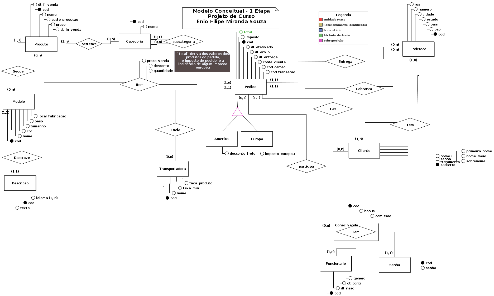

  

# Etapa 2 - Projeto de Curso

## Ênio Filipe Miranda Souza

### Ciência da Computação

### Fundamento de Banco de Dados

Descrição de domínio do Diagrama Entidade-Relacionamento construído na Etapa 1 e mapemanto do DER para Modelo Relacional.

Links relacionados ao trabalho:

<a href="https://github.com/eniofilipe/Fundamentos-de-Banco-de-Dados/tree/master/2%20Etapa">Repositório da etapa 2 com o mapeamento feito passo-a-passo.</a>

## 1 - Conjunto de Entidades

### 1.1 - Produto

<u>Descrição:</u> Representa cada produto e suas características de comercialização.

<u>Atributos:</u>

<table >
<thead>
  <tr>
    <th  scope="col">Nome</th>
    <th  scope="col">Descrição</th>
    <th  scope="col">Tipo e formato</th>
    </tr>
</thead>
<tbody>
    <tr >
    <td  ><u>COD</u></td>
    <td >Código de identificação do produto</td>
    <td >BIGINT > 0, número maior que 0, UNIQUE e NOT_NULL, gerado automaticamente pelo banco</td>
  </tr>
  <tr >
    <td  >NOME</td>
    <td >Nome do produto</td>
    <td >VARCHAR(30) cadeia de caracteres com no máximo 30 caracteres</td>
  </tr>
    <tr >
    <td  >CUSTO_PRODUCAO</td>
    <td >Custo de produção do produto</td>
    <td >FLOAT >= 0, valor em ponto flutuante maior ou igual a 0, podendo ser restringido a 3 ou 2 casas decimais</td>
  </tr>
    <tr >
    <td  >PRECO</td>
    <td >Preço do produto</td>
    <td >FLOAT >= 0, valor em ponto flutuante maior ou igual a 0, podendo ser restringido a 3 ou 2 casas decimais</td>
  </tr>
  <tr >
    <td  >DT_IN_VENDA</td>
    <td >Data de início de venda do produto</td>
    <td >DATE OU TIMESTAMPS representação de data. Obs.: Salvar no banco com GMT 0</td>
  </tr>
  <tr >
    <td  >DT_FI_VENDA</td>
    <td >Data de fim de venda do produto</td>
    <td >DATE OU TIMESTAMPS representação de data. Obs.: Salvar no banco com GMT 0</td>
  </tr>
  </tbody>
</table>

 

### 1.2 - Modelo

<u>Descrição:</u> Representa o modelo a ser seguido por determinado produto, especificando seus atributos específicos.

<u>Atributos:</u>

<table >
  <tr>
    <th  scope="col">Nome</th>
    <th  scope="col">Descrição</th>
    <th  scope="col">Tipo e formato</th>
    </tr>
    <tr >
    <td  ><u>COD</u></td>
    <td >Código de identificação do modelo</td>
    <td >BIGINT > 0, número maior que 0, UNIQUE e NOT_NULL, gerado automaticamente pelo banco</td>
  </tr>
  <tr >
    <td  >NOME</td>
    <td >Nome do modelo</td>
    <td >VARCHAR(30) cadeia de caracteres com no máximo 30 caracteres</td>
  </tr>
  <tr >
    <td  >COR</td>
    <td >Decreve a cor referente ao modelo</td>
    <td >VARCHAR(20) cadeia de caracteres com no máximo 20 caracteres</td>
  </tr>
    <tr >
    <td  >TAM</td>
    <td >Descreve o tamanho em milímetros referente ao modelo</td>
    <td >BIGINT > 0 número inteiro maior que 0</td>
  </tr>
    <tr >
    <td  >PESO</td>
    <td >Descreve o peso em gramas referente ao modelo</td>
    <td >BIGINT > 0, número inteiro maior que 0</td>
  </tr>
  <tr >
    <td  >LOCAL_FABRICACAO</td>
    <td >Decreve o local de fabricação do modelo</td>
    <td >VARCHAR(10) cadeia de caracteres com no máximo 10 caracteres, restrito à "ASIA", "AMERICA", "EUROPA", "OCEANIA" ou "AFRICA"</td>
  </tr>
</table>

### 1.3 - Descrição

<u>Descrição:</u> Representa a descrição de cada modelo, podendo ser em vários idiomas.

<u>Atributos:</u>

<table >
  <tr>
    <th  scope="col">Nome</th>
    <th  scope="col">Descrição</th>
    <th  scope="col">Tipo e formato</th>
    </tr>
    <tr >
    <td  ><u>COD</u></td>
    <td >Código de identificação da descrição</td>
    <td >BIGINT > 0, número maior que 0, UNIQUE e NOT_NULL, gerado automaticamente pelo banco</td>
  </tr>
  <tr >
    <td  >TEXTO</td>
    <td >Conteúdo da descrição</td>
    <td >VARCHAR(300) cadeia de caracteres com no máximo 300 caracteres</td>
  </tr>
  <tr >
    <td  >IDIOMA</td>
    <td >Descreve um ou mais idiomas em que a descrição pode ser vista pelo usuário.</td>
    <td >CHAR(2) cadeia de caracteres com 2 caracteres - MULTIVALORADO</td>
  </tr>  
</table>

### 1.4 - Categoria

<u>Descrição:</u> Representa categorias em que os produtos podem pertencer e serem organizados.

<u>Atributos:</u>

<table >
  <tr>
    <th  scope="col">Nome</th>
    <th  scope="col">Descrição</th>
    <th  scope="col">Tipo e formato</th>
    </tr>
    <tr >
    <td  ><u>COD</u></td>
    <td >Código de identificação da categoria</td>
    <td >BIGINT > 0, número maior que 0, UNIQUE e NOT_NULL, gerado automaticamente pelo banco</td>
  </tr>
  <tr >
    <td >NOME</td>
    <td >Nome da categoria</td>
    <td >VARCHAR(30) cadeia de caracteres com no máximo 30 caracteres</td>
  </tr>
</table>

### 1.5 - Transportadora

<u>Descrição:</u> Representa as transportadoras que podem fazer entregas das vendas aos clientes.

<u>Atributos:</u>

<table >
  <tr>
    <th  scope="col">Nome</th>
    <th  scope="col">Descrição</th>
    <th  scope="col">Tipo e formato</th>
    </tr>
    <tr >
    <td  ><u>COD</u></td>
    <td >Código de identificação da transportadora</td>
    <td >BIGINT > 0, número maior que 0, UNIQUE e NOT_NULL, gerado automaticamente pelo banco</td>
  </tr>
  <tr >
    <td  >NOME</td>
    <td >Nome da transportadora</td>
    <td >VARCHAR(30) cadeia de caracteres com no máximo 30 caracteres</td>
  </tr>
  <tr >
    <td  >TAXA_MIN</td>
    <td >Decreve o valor mínimo de total de venda para que a transportadora esteja apta a entregar a venda.</td>
    <td >FLOAT >= 0 valor em ponto flutuante maior ou igual a 0, podendo ser restringido a 2 ou 3 casas decimais </td>
  </tr>
    <tr >
    <td  >TAXA_PRODUTO</td>
    <td >Descreve a taxa que cada transportadora cobra por produto na venda</td>
    <td >FLOAT >= 0 valor em ponto flutuante maior ou igual a 0, podendo ser restringido a 2 ou 3 casas decimais </td>
  </tr>
</table>

### 1.6 - Funcionário

<u>Descrição:</u> Representa cada funcionário que pode realizar uma venda e seus dados principais.

<u>Atributos:</u>

<table >
  <tr>
    <th  scope="col">Nome</th>
    <th  scope="col">Descrição</th>
    <th  scope="col">Tipo e formato</th>
    </tr>
    <tr >
    <td  ><u>COD</u></td>
    <td >Código de identificação do Funcionário</td>
    <td >BIGINT > 0, número maior que 0, UNIQUE e NOT_NULL, gerado automaticamente pelo banco</td>
  </tr>
  <tr >
    <td >GENERO</td>
    <td >Descreve o gênero ao qual cada funcionário se identifica</td>
    <td >VARCHAR(30) cadeia de caracteres com no máximo 30 caracteres</td>
  </tr>
    <tr >
    <td  >DT_CONTR</td>
    <td >Descreve a data de contratação do funcionário</td>
    <td >DATE OU TIMESTAMPS representação de data. Obs.: Salvar no banco com GMT 0</td>
  </tr>
  <tr >
    <td  >DT_NASC</td>
    <td >Descreve a data de nascimento do funcionário</td>
    <td >DATE OU TIMESTAMPS representação de data. Obs.: Salvar no banco com GMT 0</td>
  </tr>
</table>

### 1.7 - Senha

<u>Descrição:</u> Representa as senhas que os funcionários podem ter cadastradas no sistema.

<u>Atributos:</u>

<table >
  <tr>
    <th  scope="col">Nome</th>
    <th  scope="col">Descrição</th>
    <th  scope="col">Tipo e formato</th>
    </tr>
    <tr >
    <td  ><u>COD</u></td>
    <td >Código de identificação da Senha</td>
    <td >BIGINT > 0, número maior que 0, UNIQUE e NOT_NULL, gerado automaticamente pelo banco</td>
  </tr>
  <tr >
    <td  >SENHA</td>
    <td >Senha do funcionário</td>
    <td >VARCHAR(30) cadeia de caracteres com no mínimo 7 e no máximo 30 caracteres</td>
  </tr>
</table>

### 1.8 - Conec_Venda

<u>Descrição:</u> Conector de venda, Relacionamento Agregado, representa a uma sessão do funcionário que o permite participar de uma venda.

<u>Atributos:</u>

<table >
  <tr>
    <th  scope="col">Nome</th>
    <th  scope="col">Descrição</th>
    <th  scope="col">Tipo e formato</th>
    </tr>
    <tr >
    <td  ><u>COD</u></td>
    <td >Código de identificação do conector</td>
    <td >BIGINT > 0, número maior que 0, UNIQUE e NOT_NULL, gerado automaticamente pelo banco</td>
  </tr>
  <tr >
    <td  >BONUS</td>
    <td >Decreve o bônus que o Funcionário pode receber.</td>
    <td >FLOAT >=0 valor em ponto flutuante maior ou igual a 0, podendo ser restringido a 2 ou 3 casas decimais.</td>
  </tr>
  <tr >
    <td  >COMISSAO</td>
    <td >Decreve a comissão que o Funcionário pode receber pela venda.</td>
    <td >FLOAT >=0 valor em ponto flutuante maior ou igual a 0, podendo ser restringido a 2 ou 3 casas decimais.</td>
  </tr>
</table>

### 1.9 - Cliente

<u>Descrição:</u> Representa o cliente que pode fazer compras e seus dados específicos.

<u>Atributos:</u>

<table >
  <tr>
    <th  scope="col">Nome</th>
    <th  scope="col">Descrição</th>
    <th  scope="col">Tipo e formato</th>
    </tr>
    <tr >
    <td  ><u>CADASTRO</u></td>
    <td >Código de cadastro do cliente</td>
    <td >BIGINT > 0, número maior que 0, UNIQUE e NOT_NULL, gerado automaticamente pelo banco</td>
  </tr>
  <tr >
    <td  >NOME</td>
    <td >Nome do cliente</td>
    <td >VARCHAR(100) cadeia de caracteres com no máximo 100 caracteres, composto em PRIMEIRO_NOME, NOME_MEIO E SOBRENOME</td>
  </tr>
  <tr >
    <td  >SENHA</td>
    <td >Senha do cliente</td>
    <td >VARCHAR(30) NOT_NULL cadeia de caracteres com no mínimo 7 e no máximo 30 caracteres</td>
  </tr>
    <tr >
    <td  >TRATAMENTO</td>
    <td >Descreve a forma de tratamento em que o cliente gostaria de ser chamado</td>
    <td >VARCHAR(30) cadeia de caracteres com no máximo 30 caracteres</td>
  </tr>
</table>

### 1.10 - Endereço

<u>Descrição:</u> Representa os endereços dos clientes.

<u>Atributos:</u>

<table >
  <tr>
    <th  scope="col">Nome</th>
    <th  scope="col">Descrição</th>
    <th  scope="col">Tipo e formato</th>
    </tr>
    <tr >
    <td  ><u>COD</u></td>
    <td >Código de identificação do endereço</td>
    <td >BIGINT > 0, número maior que 0, UNIQUE e NOT_NULL, gerado automaticamente pelo banco</td>
  </tr>
  <tr >
    <td >RUA</td>
    <td >Descreve a rua do endereço</td>
    <td >VARCHAR(30) cadeia de caracteres com no máximo 30 caracteres</td>
  </tr>
  <tr >
    <td  >NUMERO</td>
    <td >Decreve o número do endereço</td>
    <td >INT > 0 valor inteiro maior que 0</td>
  </tr>
  <tr >
    <td >CIDADE</td>
    <td >Descreve a cidade em que o endereço está</td>
    <td >VARCHAR(30) cadeia de caracteres com no máximo 30 caracteres</td>
  </tr>
  <tr >
    <td >ESTADO</td>
    <td >Descreve o estado(Unidade Federativa) em que o endereço está</td>
    <td >VARCHAR(30) cadeia de caracteres com no máximo 30 caracteres</td>
  </tr>
  <tr >
    <td >PAIS</td>
    <td >Descreve o país em que o endereço está</td>
    <td >VARCHAR(30) cadeia de caracteres com no máximo 30 caracteres</td>
  </tr>
  <tr >
    <td >CEP</td>
    <td >Descreve o código postal do endereço</td>
    <td >VARCHAR(30) cadeia de caracteres com no máximo 30 caracteres</td>
  </tr>  
  </tr>
</table>

### 1.11 - Pedido

<u>Descrição:</u> Representa cada pedido que pode ser feito pelo cliente e seus atributos.

<u>Atributos:</u>

<table >
  <tr>
    <th  scope="col">Nome</th>
    <th  scope="col">Descrição</th>
    <th  scope="col">Tipo e formato</th>
    </tr>
    <tr >
    <td  ><u>COD</u></td>
    <td >Código de identificação do pedido</td>
    <td >BIGINT > 0, número maior que 0, UNIQUE e NOT_NULL, gerado automaticamente pelo banco</td>
  </tr>
  <tr >
    <td  >TOTAL</td>
    <td >Descreve a soma dos valores dos produtos do pedido</td>
    <td >FLOAT >= 0 valor em ponto flutuante maior ou igual a 0, derivado da soma dos preços dos produtos relacionados ao pedido</td>
  </tr>
  <tr >
    <td  >IMPOSTO</td>
    <td >Decreve porcentagem de imposto que pode incidir sobre o pedido</td>
    <td >FLOAT >= 0 valor em ponto flutuante maior ou igual a 0</td>
  </tr>
    <tr >
    <td  >CONTA_CLIENTE</td>
    <td >Descreve a conta do cliente</td>
    <td >VARCHAR(30) cadeia de caracteres com no máximo 30 caracteres</td>
  </tr>
    <tr >
    <td  >COD_CARTAO</td>
    <td >Descreve o código do cartão do cliente</td>
    <td >VARCHAR(20)> cadeia de caracteres que representa o código do cartão(16 primeiros caracteres) e a data de expiração(4 ultimos caracteres) ex: "11118888222255550725"</td>
  </tr>
  <tr >
    <td  >COD_TRANSACAO</td>
    <td >Descreve o código de transação do pagamento do pedido</td>
    <td >STRING</td>
  </tr>
  <tr >
    <td  >DT_EFETIVADO</td>
    <td >Descreve a data em que o pedido foi efetivado</td>
    <td >DATE OU TIMESTAMPS representação de data. Obs.: Salvar no banco com GMT 0</td>
  </tr>
  <tr >
    <td  >DT_ENVIO</td>
    <td >Descreve a data de envio do pedido</td>
    <td >DATE OU TIMESTAMPS representação de data. Obs.: Salvar no banco com GMT 0</td>
  </tr>
  <tr >
    <td  >DT_ENTREGA</td>
    <td >Descreve a data que o pedido foi entregue ao cliente</td>
    <td >DATE OU TIMESTAMPS representação de data. Obs.: Salvar no banco com GMT 0</td>
  </tr>
</table>

### 1.12 - America

<u>Descrição:</u> Entidade especializada da entidade cliente, representa pedidos vendidos pro mercado americano.

<u>Atributos:</u>

<table >
  <tr>
    <th  scope="col">Nome</th>
    <th  scope="col">Descrição</th>
    <th  scope="col">Tipo e formato</th>
    </tr>
    <tr >
    <td  >DESCONTO_FRETE</td>
    <td >Descreve o valor de desconto caso o pedido se encaixe nas específicações de desconto.</td>
    <td >FLOAT >= 0 valor em ponto flutuante maior ou igual a 0, podendo ser restringido a 2 ou 3 casas decimais</td>
  </tr>
</table>

### 1.13 - Europa

<u>Descrição:</u> Entidade especializada da entidade cliente, representa pedidos vendidos pro mercado europeu.
ou várias
<u>Atributos:</u>

<table >
  <tr>
    <th  scope="col">Nome</th>
    <th  scope="col">Descrição</th>
    <th  scope="col">Tipo e formato</th>
    </tr>
    <tr >
    <td  >IMPOSTO_EUROPEU</td>
    <td >Descreve o valor do imposto a ser aplicado caso alugum ou vários produtos se encaixem em alguma alínea do mercado europeu</td>
    <td >FLOAT >= 0 valor em ponto flutuante maior ou igual a 0, podendo ser restringido a 2 ou 3 casas decimais</td>
  </tr>
</table>

## 2 - Conjunto de Relacionamentos

### 2.1 - Segue

<u>Descrição:</u> Relacionamento entre as entidades Produto e Modelo, onde uma instancia de Produto deve estar relacionada à uma instancia de Modelo e somente 1, e uma instancia de Modelo pode estar relacionada com nenhuma ou com várias instancias de Produto.

<i>Produto segue um modelo.</i>

<u>Atributos:</u>

Sem atributos específicos.

### 2.2 - Descreve

<u>Descrição:</u>
Relacionamento entre as entidades Modelo e Descrição, onde uma instância de Modelo deve estar relacionada a uma e somente uma instância de Descrição, e uma instância de Descrição deve estar relacionada a uma e somente uma instância de Modelo.

<i>Descricao descreve modelo.</i>

<u>Atributos:</u>
Sem Atributos específicos.

### 2.3 - Pertence

<u>Descrição:</u>
Relacionamento entre as entidades Produto e Categoria, onde uma instância de Produto deve estar relacionada a pelomenos uma instância de Categoria, e uma instância de Categoria pode estar relacionada a nenhuma ou várias instâncias de Produto.

<i>Produto pertence a Categoria.</i>

<u>Atributos:</u>
Sem Atributos específicos.

### 2.4 - Subcategoria

<u>Descrição:</u>
Relacionamento unário da entidade Categoria, uma instância de Categoria pode estar relacionada a nenhuma ou várias instâncias de Categoria.

<i>Categoria é subcategoria de Categoria.</i>

<u>Atributos:</u>
Sem Atributos específicos.

### 2.5 - Item

<u>Descrição:</u>
Relacionamento entre as entidades Produto e Pedido, onde uma instância de Produto pode estar relacionado a nenhuma ou várias instâncias de Pedido, e uma instância de Pedido deve estar relacionada a pelo menos uma instância de Produto.

<i>Produto é item de Pedido.</i>

<u>Atributos:</u>

<table >
  <tr>
    <th  scope="col">Nome</th>
    <th  scope="col">Descrição</th>
    <th  scope="col">Tipo e formato</th>
    </tr>
  <tr >
    <td  >PRECO_VENDA</td>
    <td >Descreve o preço do produto no momento da venda</td>
    <td >FLOAT >=0 valor de ponto flutuante maior ou igual a 0, pode ser restringido em 2 ou 3 casas decimais</td>
  </tr>
  <tr >
    <td  >DESCONTO</td>
    <td >Descreve desconto no preço do produto, caso exista</td>
    <td >FLOAT >=0 valor de ponto flutuante maior ou igual a 0, pode ser restringido em 2 ou 3 casas decimais</td>
  </tr>
  <tr >
    <td  >QUANTIDADE</td>
    <td >Descreve a quantidade do produto relacionado a ser inserido no pedido</td>
    <td >INT > 0 valor inteiro maior que 0.</td>
  </tr>
    
</table>

### 2.6 - Envia

<u>Descrição:</u>
Relacionamento entre as entidades Transportadora e Pedido, onde uma instância de pedido deve estar relacionado a uma e somente uma instância de Transportadora, e uma instância de Transportadora pode estar relacionada à nenhuma ou várias instâncias de Pedido.

<i>Transportadora envia Pedido.</i>

<u>Atributos:</u>
Sem Atributos específicos.

### 2.7 - Entrega

<u>Descrição:</u>
Relacionamento entre as entidades Endereço e Pedido, onde uma instância de pedido deve estar relacionado a uma e somente uma instância de Endereço, e uma instância de Endereço pode estar relacionada à nenhuma ou várias instâncias de Pedido.

<i>Pedido é entregue no Endereço.</i>

<u>Atributos:</u>
Sem Atributos específicos.

### 2.8 - Cobrança

<u>Descrição:</u>
Relacionamento entre as entidades Endereço e Pedido, onde uma instância de pedido deve estar relacionado a uma e somente uma instância de Endereço, e uma instância de Endereço pode estar relacionada à nenhuma ou várias instâncias de Pedido.

<i>Pedido é cobrado no Endereço.</i>

<u>Atributos:</u>
Sem Atributos específicos.

### 2.9 - Tem

<u>Descrição:</u>
Relacionamento entre as entidades Endereço e Cliente, onde uma instância de Cliente deve estar relacionado a pelo menos uma instãncia de Endereço, e uma instância de Endereço deve estar relacionada à pelomenos uma instância de Cliente.

<i>Cliente tem Endereço.</i>

<u>Atributos:</u>
Sem Atributos específicos.

### 2.10 - Faz

<u>Descrição:</u>
Relacionamento entre as entidades Cliente e Pedido, onde uma instância de pedido deve estar relacionado a uma e somente uma instância de Cliente, e uma instância de Cliente pode estar relacionada à nenhuma ou várias instâncias de Pedido.

<i>Cliente faz Pedido.</i>

<u>Atributos:</u>
Sem Atributos específicos.

### 2.11 - Tem

<u>Descrição:</u>
Relacionamento entre as entidades Funcionário e Senha, onde uma instância de Senha deve estar relacionado a uma e somente uma instância de Funcionário, e uma instância de Funcionário deve estar relacionada à pelo menos uma instância de Senha.

<i>Funcionário tem Senha.</i>

<u>Atributos:</u>
Sem Atributos específicos.

### 2.12 - Participa

<u>Descrição:</u>
Relacionamento entre as entidades Pedido e Conector de Vendas, onde uma instância de Conector de Vendas pode estar relacionada à nenhuma ou várias instâncias de Pedido, e uma instância de Pedido pode estar relacionado a nenhuma ou uma instância de Conector de Vendas.

<i>Conector de Vendas participa do Pedido</i>

<u>Atributos:</u>
Sem Atributos específicos.

## 3 - DER Corrigido

## 4 - Mapeamento final em modelo relacional

### 4.1 - Algumas considerações sobre o mapeamento

#### 4.1.1 - Mapeamento da Abstração de Generalização da entidade Pedido

Foi escolhido o procedimento padrão 4, pois os são poucos os atributos das Entidades Específicas que também não têm relacionamentos específicos. Sendo identificadas pelo atributo "MERCADO".

#### 4.1.2 - Mapeamento do Atributo Multivalorado IDIOMA

Como não é conhecido a composição desse atributo, podendo ele ser diversos, foi escolhido mapear para
uma relação específica, sendo identificada pelo valor do atributo idioma e da chave da descrição que faz parte.

#### 4.1.3 - Mapeamento do Atributo Composto NOME

Como é conhecida a composição do atributo, escolheu - se inserir os atributos da sua composição à entidade Cliente.

