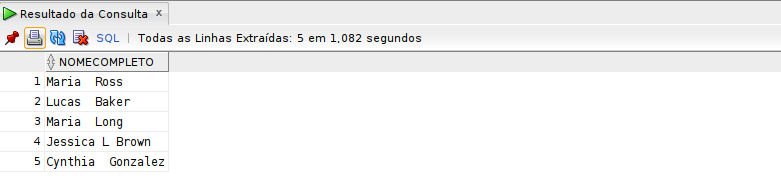
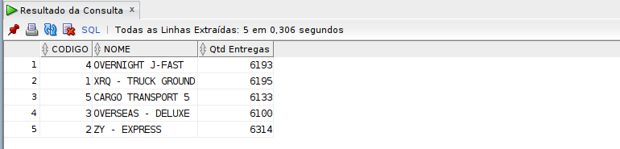
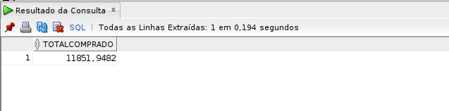
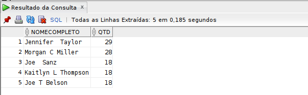
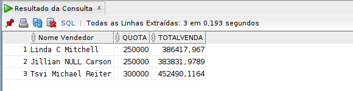

<div class="logo-if">
  
</div>
<div class="title">

# Etapa 4.2 - Projeto de Curso

## Ênio Filipe Miranda Souza

### Ciência da Computação

### Fundamento de Banco de Dados

Execução de Scrips em SQL

</div>

<div class="page"/>

## 1 - Questões propostas, códigos e resultados

### 1.1 Listar os nomes completos dos clientes atendidos pelo vendedor “Michael Blythe”.

```sql
SELECT cliente.primeironome ||' '|| cliente.nomedomeio ||' '|| cliente.sobrenome AS nomecompleto
FROM cliente
JOIN pedido
ON cliente.codigo = pedido.codigocliente
JOIN (
    SELECT codigo, primeironome ||' '|| nomedomeio ||' '|| sobrenome AS nomevendedor
    FROM vendedor
) vend
ON pedido.codigovendedor = vend.codigo
WHERE vend.nomevendedor LIKE '%Michael%Blythe%'
AND rownum <=5;
```



</hr>

<div class="page"/>

### 1.2 Listar o número de clientes atendidos pelo vendedor “Jillian Carson”.

```sql
SELECT count(DISTINCT cliente.codigo) "Clientes Atendidos"
FROM cliente
JOIN pedido
ON cliente.codigo = pedido.codigocliente
JOIN (
    SELECT codigo, primeironome ||' '|| nomedomeio ||' '|| sobrenome AS nomevendedor
    FROM vendedor
) vend
ON pedido.codigovendedor = vend.codigo
WHERE vend.nomevendedor LIKE '%Jillian%Carson%'
AND rownum <=5;
```


</hr>

### 1.3 Listar o código, nome e quantidade de entregas realizadas por cada transportadora.

```sql
SELECT transportadora.codigo, transportadora.nome, count(pedido.codigo) "Qtd Entregas"
FROM transportadora, pedido
WHERE transportadora.codigo = pedido.codigotransportadora
GROUP BY transportadora.codigo, transportadora.nome;
```



### 1.4 Listar o código, nome e preço do produto mais caro.

```sql
SELECT produto.codigo, produto.nome, produto.preco
FROM produto, (SELECT MAX(preco) AS max_preco FROM produto) prod
WHERE produto.preco = prod.max_preco;
```


<div class="page"/>

### 1.5 Listar o valor total de compras realizadas pela cliente “Jasmine E Clark”.

```sql
SELECT SUM((detalhespedido.precounitario*detalhespedido.quantidade)-detalhespedido.desconto) AS totalcomprado
FROM detalhespedido
JOIN (
    SELECT pedido.codigo AS cod, cli.nomecompleto AS n
    FROM pedido
    JOIN (
        SELECT cliente.codigo AS cod, cliente.primeironome ||' '|| cliente.nomedomeio ||' '|| cliente.sobrenome AS nomecompleto
        FROM cliente
    ) cli
    ON pedido.codigocliente = cli.cod
    WHERE cli.nomecompleto LIKE '%Jasmine%E%Clark%'
) pedi
ON detalhespedido.codigopedido = pedi.cod;
```



### 1.6 Listar o código e o nome completo de todos os vendedores que não realizaram nenhuma venda.

```sql
SELECT vendedor.codigo, vendedor.primeironome ||' '|| vendedor.nomedomeio ||' '|| vendedor.sobrenome AS nomecompleto
FROM vendedor
LEFT JOIN pedido
ON vendedor.codigo=pedido.codigovendedor
WHERE pedido.codigovendedor IS NULL;
```


### 1.7 Para os modelos de produtos que possuem descrição em mais de um idioma, listar o nome do modelo, a descrição e o idioma.

```sql
SELECT modelo.nome, descricao.descricao, idioma.nome
FROM modelo, descricao, idioma
WHERE modelo.codigo = descricao.codigomodelo
AND descricao.siglaidioma = idioma.sigla
AND modelo.codigo IN (
    SELECT descricao.codigomodelo
    FROM descricao
    WHERE descricao.codigomodelo IS NOT NULL
    GROUP BY descricao.codigomodelo
    HAVING count(*)>1
)
AND rownum <=5;
```


### 1.8 Para os clientes que já fizeram ao menos 15 pedidos, listar o nome completo e a quantidade de compras realizadas ordenada de forma decrescente.

```sql
SELECT cliente.primeironome ||' '|| cliente.nomedomeio ||' '|| cliente.sobrenome AS nomecompleto, ped.qtd
FROM cliente
JOIN (
    SELECT pedido.codigocliente AS cod, count(*) AS qtd
    FROM pedido
    WHERE pedido.codigocliente IS NOT NULL
    GROUP BY pedido.codigocliente
    HAVING count(*) >= 15
) ped
ON cliente.codigo = ped.cod
WHERE rownum <=5
ORDER BY ped.qtd DESC;
```



<div class="page"/>

### 1.9 Para os clientes que compraram algum dos produtos da seguinte lista (“Road-250 Red, 58”, “Touring-1000 Yellow, 50”, “Men s Bib-Shorts, S”), listar a data dos pedidos, os seus nomes, o endereço de entrega, o nome do produto e a quantidade comprada.

```sql
SELECT pedido.dtpedido "Data Pedido",
cliente.primeironome ||' '|| cliente.nomedomeio ||' '|| cliente.sobrenome "Nome Cliente",
endereco.logradouro "Endereco",
dt.n "Produto",
dt.qtd "Quantidade"
FROM pedido
JOIN (
    SELECT detalhespedido.codigopedido AS ped, detalhespedido.codigoproduto AS pro, detalhespedido.quantidade AS qtd, produto.nome AS n
    FROM detalhespedido, produto
    WHERE detalhespedido.codigoproduto = produto.codigo
    AND (produto.nome LIKE '%Road-250%Red,%58%' OR produto.nome LIKE '%Touring-1000%Yellow,%50%' OR produto.nome LIKE '%Men%s%Bib-Shorts,%S%')
) dt
ON pedido.codigo = dt.ped
JOIN endereco
ON pedido.enderecoentrega = endereco.id
JOIN cliente
ON pedido.codigocliente = cliente.codigo
WHERE rownum <=5;
```


### 1.10 Listar os produtos comprados (código, nome e preço) pelo cliente “Marshall M Shen” no ano de 2007.

```sql
SELECT produto.codigo, produto.nome, produto.preco
FROM produto
JOIN (
    SELECT detalhespedido.codigopedido, detalhespedido.codigoproduto AS codprod, detalhespedido.precounitario
    FROM detalhespedido
    JOIN(
        SELECT pedido.codigo AS cod, pedido.dtpedido, cli.nomecompleto
        FROM pedido
        JOIN (
            SELECT cliente.codigo AS cod, cliente.primeironome ||' '|| cliente.nomedomeio ||' '|| cliente.sobrenome AS nomecompleto
            FROM cliente
        ) cli
        ON cli.cod = pedido.codigocliente
        WHERE pedido.dtpedido > '31/12/2006 23:59:59'
        AND pedido.dtpedido < '01/01/2008 00:00:00'
        AND cli.nomecompleto LIKE '%Marshal%M%Shen%'
    ) ped
    ON ped.cod = detalhespedido.codigopedido
) det
ON produto.codigo = det.codprod
WHERE rownum <=5
GROUP BY produto.codigo, produto.nome, produto.preco;
```


### 1.11 Listar o nome e o preço do produto mais comprado pela cliente “Jennifer Taylor”, e a quantidade de vezes em que foi comprado.

```sql
SELECT *
FROM (
    SELECT produto.nome, produto.preco, count(*) contador
    FROM produto
    JOIN (
        SELECT detalhespedido.codigopedido, detalhespedido.codigoproduto AS codprod, detalhespedido.precounitario
        FROM detalhespedido
        JOIN(
            SELECT pedido.codigo AS cod, cli.nomecompleto
            FROM pedido
            JOIN (
                SELECT cliente.codigo AS cod, cliente.primeironome ||' '|| cliente.nomedomeio ||' '|| cliente.sobrenome AS nomecompleto
                FROM cliente
            ) cli
            ON cli.cod = pedido.codigocliente
            WHERE cli.nomecompleto LIKE '%Jennifer%Taylor%'
        ) ped
        ON ped.cod = detalhespedido.codigopedido
    ) det
    ON produto.codigo = det.codprod
    GROUP BY produto.codigo, produto.nome, produto.preco
    ORDER BY contador DESC
)
WHERE ROWNUM = 1;
```


### 1.12 Para os pedidos em que o endereço de fatura é diferente do endereço de entrega, listar o nome completo do cliente que recebeu o pedido, mas não realizou o pedido.

```sql
SELECT cliente.primeironome ||' '|| cliente.nomedomeio ||' '|| cliente.sobrenome "Nome Cliente"
FROM cliente, (
    SELECT PEDIDO.CODIGO, pedido.codigocliente, clienteendereco.codigocliente AS codcli
    FROM PEDIDO
    JOIN clienteendereco
    ON clienteendereco.codigocliente != pedido.codigocliente
    AND clienteendereco.idendereco = pedido.enderecoentrega
    WHERE pedido.enderecoentrega != pedido.enderecofatura
) cli
WHERE cliente.codigo = cli.codcli
AND rownum <=5;
```


<div class="page"/>

### 1.13 Listar o nome completo, a quota definida e o total de vendas dos vendedores que atingiram sua quota de vendas no primeiro bimestre (janeiro e fevereiro) de 2006.

```sql
SELECT vendedor.primeironome ||' '|| vendedor.nomedomeio ||' '|| vendedor.sobrenome "Nome Vendedor",
vendedor.quota,
r.totalvenda
FROM vendedor
JOIN (
    Select v.codvend AS codvend, sum(v.totalvenda) AS totalvenda
    From (
        SELECT ped.cod AS cod, ped.codvend AS codvend, sum((detalhespedido.precounitario*detalhespedido.quantidade)-detalhespedido.desconto) totalvenda
        FROM detalhespedido
        JOIN (
            SELECT pedido.codigo AS cod, pedido.codigovendedor AS codvend
            FROM pedido
            WHERE pedido.dtpedido > '31/12/2005 23:59:59'
            AND pedido.dtpedido < '01/03/2006 00:00:00'
            AND pedido.codigovendedor IS NOT NULL
        ) ped
        ON detalhespedido.codigopedido = ped.cod
        GROUP BY ped.codvend, ped.cod
    ) v
    GROUP BY v.codvend
) r
ON vendedor.codigo = r.codvend
WHERE r.totalvenda >= vendedor.quota
AND rownum <=5;
```



### 1.14 Para os clientes que compraram a mesma quantidade de produtos, listar seus nomes completos, o código de seus pedidos e a quantidade de itens comprados.

```sql
SELECT cli.nomecompleto, pedido.codigo, cli.quantidade, sum(detalhespedido.quantidade) AS quantidadepedido
FROM pedido, detalhespedido, (
    SELECT cliente.primeironome ||' '|| cliente.nomedomeio ||' '|| cliente.sobrenome AS nomecompleto,
    det.codcli AS codcli,
    det.quantidade AS quantidade
    FROM cliente, (
        SELECT pedido.codigocliente AS codcli, sum(detalhespedido.quantidade) AS quantidade
        FROM pedido, detalhespedido
        WHERE pedido.codigo = detalhespedido.codigopedido
        GROUP BY pedido.codigocliente
    ) det
    WHERE cliente.codigo = det.codcli
    AND det.quantidade IN (SELECT det.quantidade
            FROM (
                SELECT pedido.codigocliente AS codcli, sum(detalhespedido.quantidade) AS quantidade
                FROM pedido, detalhespedido
                WHERE pedido.codigo = detalhespedido.codigopedido
                GROUP BY pedido.codigocliente
            ) det
    GROUP BY det.quantidade
    HAVING count(*)>1)
) cli
WHERE pedido.codigocliente = cli.codcli
AND pedido.codigo = detalhespedido.codigopedido
GROUP BY cli.nomecompleto, pedido.codigo, cli.quantidade
ORDER BY cli.nomecompleto asc
FETCH FIRST 5 ROWS ONLY;
```


### 1.15 Listar todos os clientes que também compraram todos os produtos comprados pelo cliente “Lucas B Ross”.

```sql
SELECT ocli.codcli, ocli.nomecompleto
FROM pedido, (
    SELECT cliente.codigo AS codcli, cliente.primeironome ||' '|| cliente.nomedomeio ||' '|| cliente.sobrenome AS nomecompleto
    FROM cliente
) ocli
Where ocli.codcli = pedido.codigocliente
AND ocli.nomecompleto NOT LIKE '%Lucas%B%Ross%'
AND pedido.codigo IN (
    SELECT detalhespedido.codigopedido
    FROM detalhespedido
    where detalhespedido.codigoproduto IN (
        SELECT detalhespedido.codigoproduto
        FROM detalhespedido, (
            SELECT pedido.codigo AS codped
            FROM pedido, (
                SELECT cliente.codigo AS codcli, cliente.primeironome ||' '|| cliente.nomedomeio ||' '|| cliente.sobrenome AS nomecompleto
                FROM cliente
            ) cli
            WHERE pedido.codigocliente = cli.codcli
            AND cli.nomecompleto LIKE '%Lucas%B%Ross'
        ) ped
        WHERE detalhespedido.codigopedido = ped.codped
    ))
ORDER BY ocli.nomecompleto;
```


